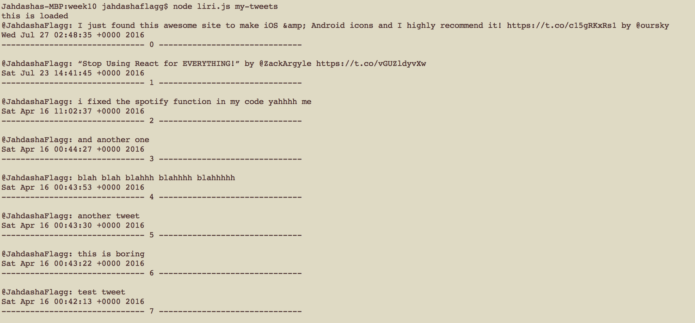
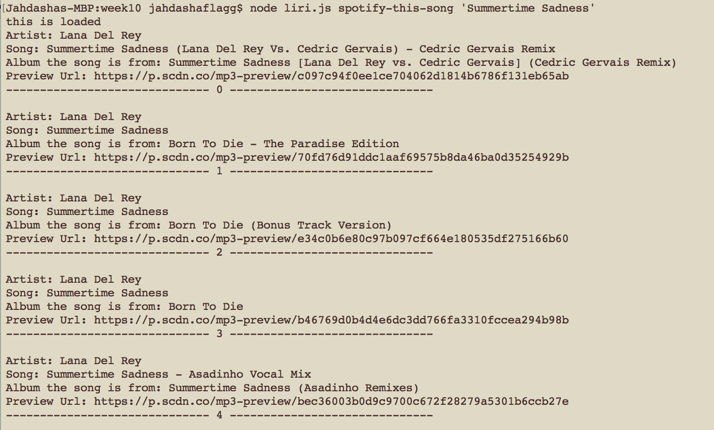

# Week 10 homework assignment:
## LIRI Node App


### Introduction

* I created a node.js app called LIRI. LIRI is like SIRI (from an iphone).
* It must be ran in the command line.
* LIRI is a Language Interpretation and Recognition Interface.
* LIRI will be a command line node app that takes in parameters and gives you back data.
* LIRI will do any of the below command when you enter them into the command line.
	1. my-tweets
	2. spotify-this-song
	3. movie-this
	4. do-what-it-says

* Type in node liri.js to get the instructions on how to enter the commands correctly.
So if you were to type the below command you'd get the last 20 tweets I created (There may not be 20 tweets for me I just created an account)

* Example for twitter

```
node liri.js my-tweets
```

* Example for spotify

```
node liri.js spotify-this-song '<song name here>'
```
* shows the following information about the song in the terminal
	1. artist(s)
	2. song name
	3. preview link of the song from spotify
	4. album that the song is a part of

* Example for movie
```
node liri.js movie-this '<movie name here>'
```
* this would output the following information to the terminal:
	1. Title
	2. Year
	3. IMDB Rating
	4. Country
	5. Language
	6. Plot
	7. Actors
	8. Rotten Tomatoes Rating
	9. Rotten Tomatoes URL


* Example for do what it says
```
node liri.js do-what-it-says
```


* These are the npm packages I used and are needed to run the app
	1. fs package in node
	2. [twitter](https://www.npmjs.com/package/twitter)
	3. [spotify](https://www.npmjs.com/package/spotify)
	4. [request](https://www.npmjs.com/package/request)

* to install these npm packages run these commands one at a time.
```
npm install twitter
npm install spotify
npm install request
```

# Copyright
Jahdasha Flagg (C) 2016. All Rights Reserved.
